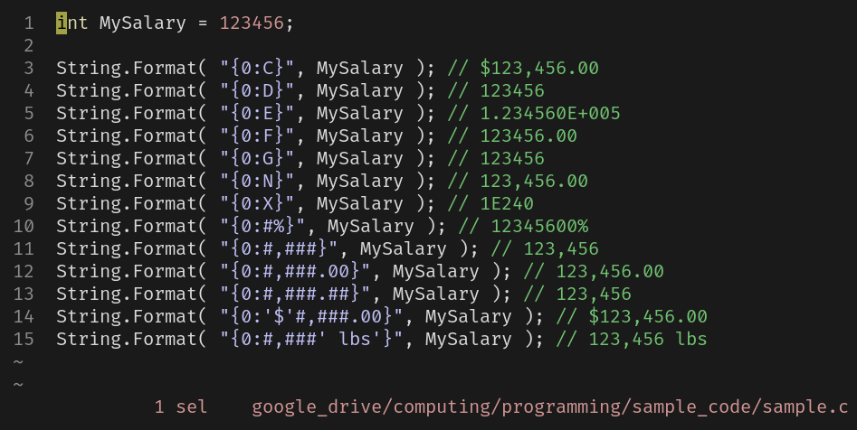
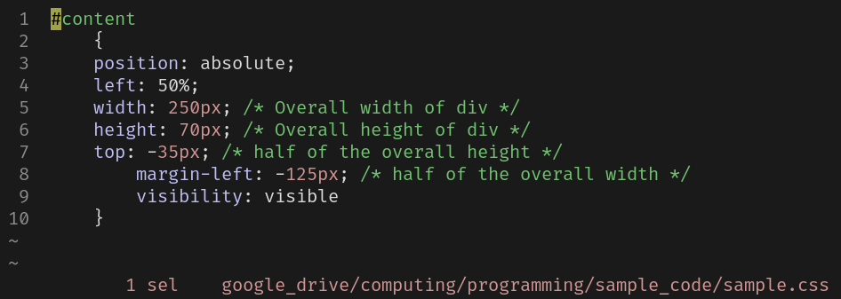
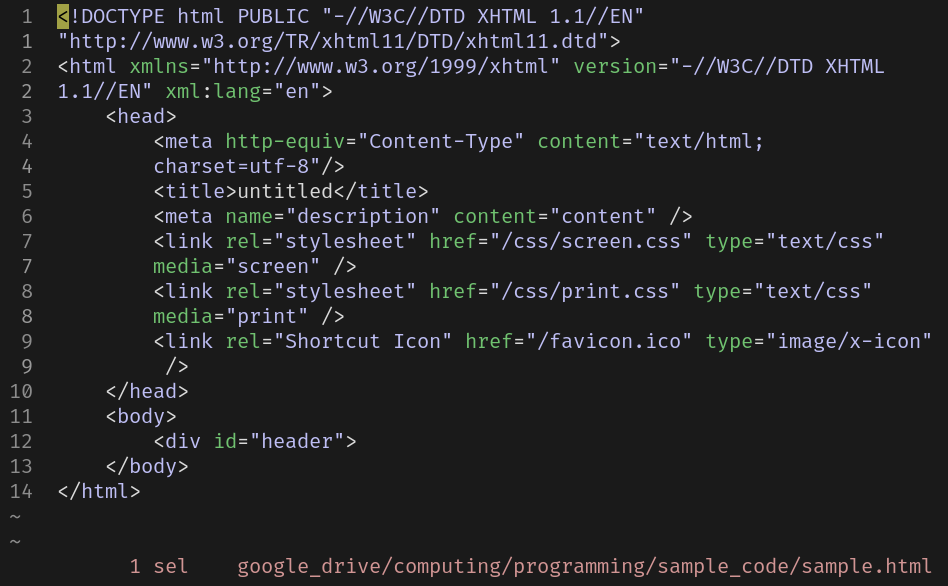
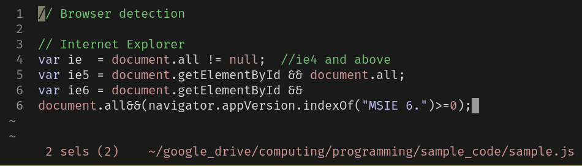
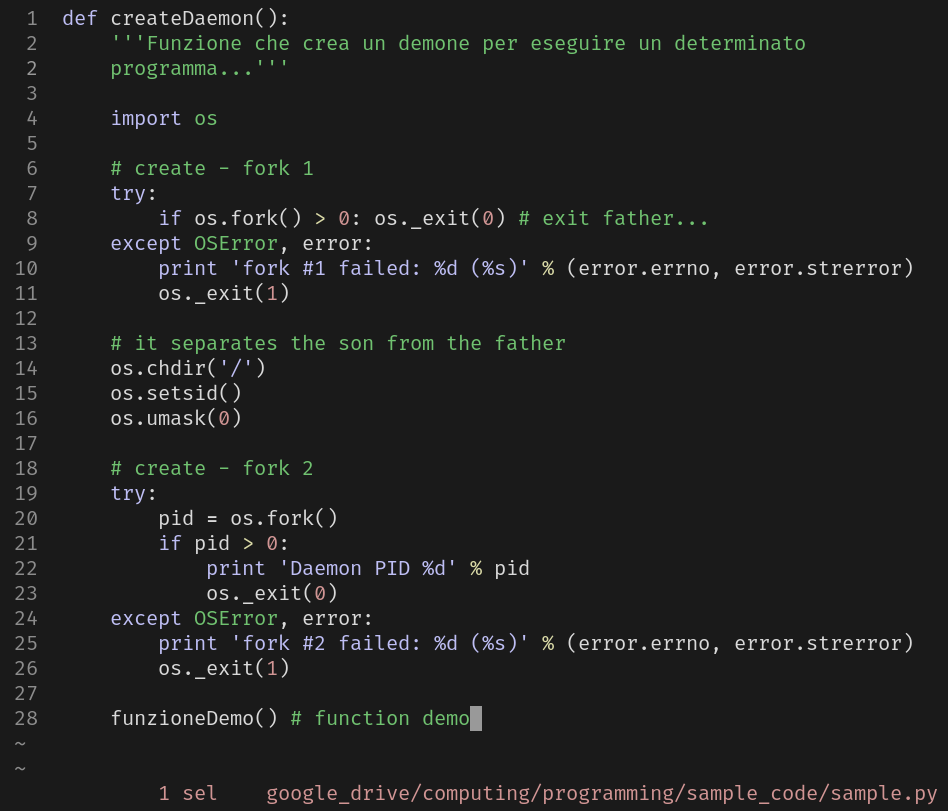
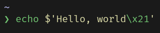
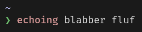
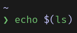

# Base 16 colors

    #: black
    color0 #1A1A1A
    color8 #1A1A1A

    #: red
    color1 #D19594
    color9 #D19594

    #: green
    color2  #70C270
    color10 #70C270

    #: blue
    color4  #BEBEF4
    color12 #BEBEF4

    #: yellow
    color3  #D9D9A6
    color11 #D9D9A6

    #: magenta
    color5  #BEBEF4
    color13 #BEBEF4

    #: cyan
    color6  #70C270
    color14 #70C270

    #: white
    color7  #D9D9D9
    color15 #D9D9D9

### Note
`black` is currently defined as a gray. It could instead be  
defined as a black. Similarly, `white` is currently defined as  
a white, though it could also be a gray.

## Configurations
- [kitty/deuters_delight.conf](./kakoune/deuters_delight.kak)
- [kakoune/deuters_delight.kak](./kakoune/deuters_delight.kak)
- [less_variable.txt](./less_variable.txt)
- [ls_colors_variable.txt](./ls_colors_variable.txt)

## Screenshots
These shots are from Kakoune, whose theme isn't finished yet. For  
example, yellow is defined in my theme, but it doesn't show in  
the shots.

---

These shots are from the Z shell prompt [powerlevel10k](https://github.com/romkatv/powerlevel10k) with the [zsh-syntax-highlighting](https://github.com/zsh-users/zsh-syntax-highlighting) hook installed.

